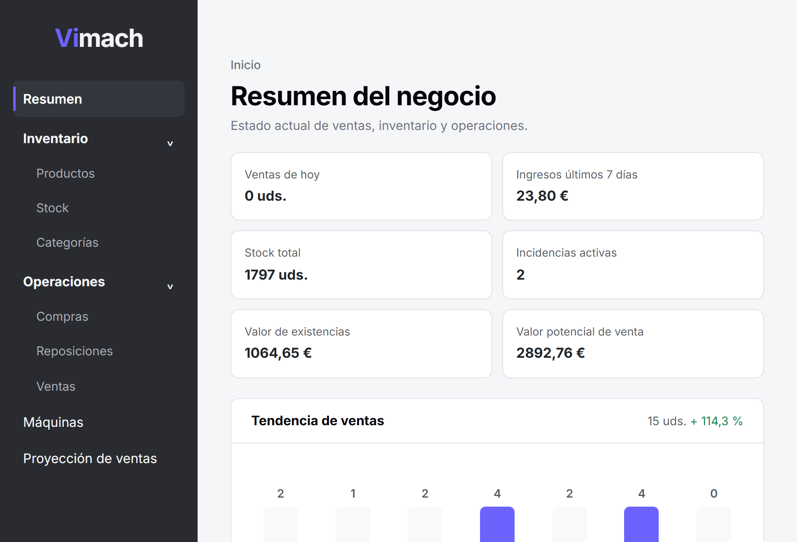
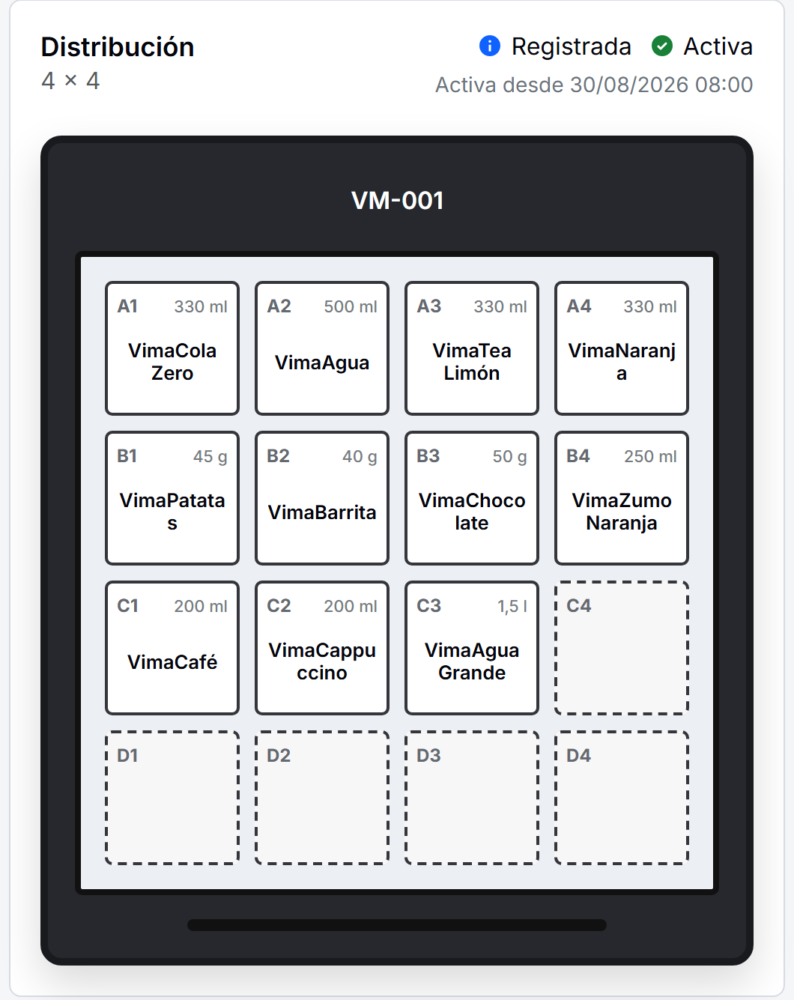
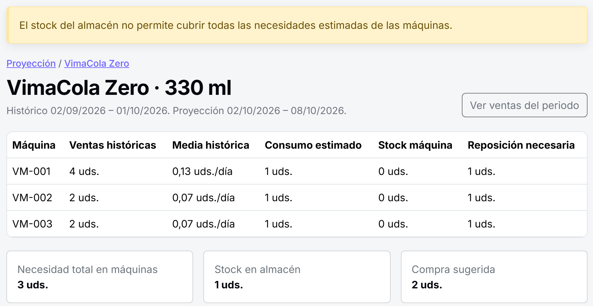

# Vimach

Vimach es una aplicación web desarrollada como parte de un Trabajo de Fin de Grado del Grado en Ingeniería Informática – Ingeniería del Software de la Escuela Técnica Superior de Ingeniería Informática (ETSII) de la Universidad de Sevilla. Vimach reúne en una única aplicación la gestión de las máquinas expendedoras y de las operaciones relacionadas con ellas. Permite controlar el inventario, registrar compras, reposiciones y ventas, organizar los productos dentro de cada máquina y gestionar los precios. También incluye una proyección de ventas para ayudar a prever futuras necesidades de compra y reposición.

## Instalación y ejecución

### Requisitos previos

Para ejecutar la aplicación es necesario tener instalado:

- Git.
- Docker Desktop, iniciado y en ejecución.

La aplicación se ha probado en Windows con Git 2.46.2.windows.1 y Docker Desktop 4.43.2 (199162). Es posible que funcione correctamente con otras versiones, aunque no se han verificado de forma específica.

### 1. Clonar el repositorio

```bash
git clone <URL_DEL_REPOSITORIO>
cd tfg-vending
```

### 2. Crear el archivo `.env`

El repositorio incluye un archivo `.env.example` con las variables necesarias. Debe copiarse con el nombre `.env` antes de levantar los contenedores.

El archivo `.env` debe contener una configuración similar a la siguiente:

```env
POSTGRES_DB=vending_db
POSTGRES_USER=vending_user
POSTGRES_PASSWORD=change-me
POSTGRES_HOST=db
POSTGRES_PORT=5432

DJANGO_SECRET_KEY=change-me
DJANGO_DEBUG=True
DJANGO_ALLOWED_HOSTS=localhost,127.0.0.1
```

Las variables que puede ser necesario modificar son:

- `POSTGRES_PASSWORD`: contraseña del usuario de PostgreSQL. Para una ejecución local puede establecerse una contraseña propia.
- `DJANGO_SECRET_KEY`: clave utilizada internamente por Django. Debe sustituirse por un valor propio.
- `DJANGO_ALLOWED_HOSTS`: hosts desde los que se permitirá acceder a la aplicación. Solo es necesario modificarla si se va a acceder desde una dirección distinta de las configuradas por defecto.

### 3. Levantar la aplicación

Con Docker Desktop en ejecución, desde la raíz del proyecto:

```bash
docker compose up -d --build
```
La opción `-d` (`--detach`) ejecuta los contenedores en segundo plano.

En las ejecuciones posteriores puede utilizarse simplemente:

```bash
docker compose up -d
```

Al iniciar el servicio web se ejecutan automáticamente las migraciones de Django antes de arrancar el servidor.

### 4. Cargar datos de demostración (opcional)

La aplicación puede utilizarse con una base de datos vacía o poblarse con datos de prueba mediante el comando:

```bash
docker compose exec web python manage.py seed_demo_data
```

### 5. Acceder a la aplicación

Con los contenedores en ejecución, la aplicación estará disponible en http://localhost:8000

## Uso básico de la aplicación

La navegación principal de Vimach permite acceder a los distintos módulos de
gestión. A continuación se resumen las principales funciones disponibles en cada
uno de ellos.

- **Inicio**: muestra un dashboard con información resumida sobre el estado
  general de la aplicación, incluyendo datos de ventas, ingresos e inventario.

  

- **Productos**: permite crear, modificar y consultar los productos del catálogo.
  Para cada producto también se muestra información sobre sus existencias y su
  valoración económica:

  - **Último coste de compra**: muestra cuánto costó la unidad, sin IVA, en la última compra registrada.
  - **Coste promedio**: coste medio de adquisición del producto, teniendo en cuenta
    tanto el precio como la cantidad adquirida en las distintas compras.
  - **Valor de las existencias**: valor estimado del stock actual según su coste
    promedio de compra.
  - **Valor potencial de venta**: importe que podría obtenerse si se vendiera todo
    el stock disponible. Para las unidades del almacén se utiliza el precio base y
    para las unidades situadas en máquinas, el precio efectivo correspondiente.
  - **Margen bruto potencial**: indica en porcentaje la diferencia entre lo que ha
  costado el stock disponible y lo que se obtendría al venderlo, utilizando importes
  sin IVA.

- **Máquinas**: permite registrar y consultar las máquinas expendedoras, junto con
  sus datos básicos y dimensiones. Cada máquina puede tener una política de precios
  propia y excepciones para productos concretos. Al calcular el precio de venta se
  utiliza primero la excepción del producto si existe. Si no hay ninguna, se aplica
  la política de precios de la máquina y, en último caso, el precio base del producto.

  Dentro de cada máquina también puede gestionarse la **disposición de productos**.
  Las posiciones se organizan sobre una cuadrícula y pueden ocupar una o varias
  celdas. Las disposiciones se crean inicialmente como borradores y, una vez
  registradas, quedan conservadas en el histórico. Una disposición anterior puede
  volver a activarse, manteniéndose los distintos periodos en los que estuvo activa.

  <p align="center">
    
  </p>

- **Inventario**: permite consultar las existencias de cada producto diferenciando
  entre **stock total**, **stock disponible en almacén** y **stock disponible en cada
  máquina**. El stock total corresponde a la suma de las unidades almacenadas y las
  existentes en las máquinas.

- **Compras**: permite crear compras con uno o varios productos, indicando la fecha,
  proveedor, cantidades y costes unitarios sin IVA. Una compra puede mantenerse
  como borrador antes de registrarse. Al registrarla, las unidades se incorporan al
  stock del almacén y sus costes se utilizan para actualizar el último coste y el coste
  promedio de los productos. También puede consultarse el histórico de compras.

- **Reposiciones**: permite registrar el traslado de productos desde el almacén a una
  máquina. Antes de registrar la operación se comprueba que exista stock suficiente
  en almacén y que el producto forme parte de la disposición aplicable a la máquina.
  Una vez registrada, disminuye el stock del almacén y aumenta el de la máquina.

- **Ventas**: permite consultar el histórico de ventas y registrar ventas manualmente.
  Las ventas resueltas descuentan las unidades correspondientes del stock de la
  máquina. También pueden recibirse automáticamente mediante peticiones HTTP con
  datos en formato JSON.

  Para enviar una venta se debe realizar una petición con:

  - Método: `POST`
  - URL: `http://localhost:8000/sales/receive/`
  - Tipo de contenido: `application/json`

  El cuerpo de la petición debe seguir este formato:

  ```json
  {
    "event_id": "evt-001",
    "machine_identifier": "VM-001",
    "selection": "A1",
    "occurred_at": "2026-09-02T10:30:00+02:00",
    "quantity": 1,
    "dispense_type": "paid",
    "unit_price": "1.50",
    "amount_received": "1.50",
    "payment_method": "cash"
  }
  ```

  Los campos principales son:

  - `event_id`: identificador único del evento de venta.
  - `machine_identifier`: identificador de la máquina que envía la venta.
  - `selection`: selección indicada por la máquina. Vimach utiliza la disposición
  activa en el momento de la venta para determinar qué producto corresponde a
  esa selección.
  - `occurred_at`: fecha y hora de la operación en formato ISO 8601 e incluyendo
    la zona horaria.
  - `quantity`: número de unidades vendidas. Debe ser un entero mayor que cero.
  - `dispense_type`: puede ser `paid` para una venta con cobro o `free` para una
    dispensación gratuita.
  - `unit_price`, `amount_received` y `payment_method`: permiten conservar la
    información económica comunicada por la máquina. Estos campos son opcionales.

  La petición puede enviarse utilizando herramientas como **Postman** o directamente desde la terminal.


  Si la máquina y el producto pueden identificarse y existe stock suficiente, la venta
  queda resuelta y actualiza el inventario. Si no es posible determinar la máquina o
  el producto, se conserva como pendiente para poder revisarla desde la aplicación.

  El `event_id` también se utiliza para evitar duplicados. Si se recibe de nuevo el
  mismo evento con el mismo contenido, no se crea otra venta. Si se utiliza el mismo
  identificador con datos diferentes, la nueva recepción queda marcada como conflicto
  para su revisión.


- **Proyección**: permite estimar las necesidades futuras de productos a partir del
  histórico de ventas. El usuario elige un periodo histórico y otro futuro. Con las
  ventas registradas, la aplicación calcula la media diaria de cada producto en cada
  máquina y utiliza ese dato para estimar el consumo previsto.

  Con esta estimación y el stock disponible, la aplicación calcula cantidades
  orientativas de reposición para cada máquina y una recomendación de compra por
  producto. Si el almacén dispone de unidades suficientes para cubrir las necesidades,
  la compra recomendada será cero. Las recomendaciones no generan compras ni
  reposiciones automáticamente.
  
  
## Gestión de la base de datos

### Vaciar los datos

Para eliminar los datos almacenados por Django manteniendo la estructura de la base de datos:

```bash
docker compose exec web python manage.py flush
```

Django solicitará confirmación antes de eliminar los datos.
## Ejecución de pruebas y comprobaciones
Los siguientes pasos se incluyen únicamente para reproducir las pruebas y comprobaciones descritas en la memoria del Trabajo de Fin de Grado. No son necesarios para poner en marcha y utilizar la aplicación.

### 1. Instalar las dependencias de desarrollo

Las herramientas utilizadas para las pruebas y comprobaciones adicionales se encuentran en `requirements-dev.txt`. Con los contenedores en ejecución:

```bash
docker compose exec web pip install -r requirements-dev.txt
```

### 2. Ejecutar la suite de pruebas

Las pruebas basadas en propiedades están etiquetadas con `hypothesis`. Estas pruebas ejecutan un gran número de casos generados automáticamente y, por tanto, pueden aumentar el tiempo total de ejecución de la suite. Si únicamente se desea ejecutar las pruebas funcionales y automatizadas convencionales, pueden excluirse mediante:

```bash
docker compose exec web python manage.py test --exclude-tag=hypothesis
```
Para reutilizar la base de datos de pruebas entre ejecuciones:
```bash
docker compose exec web python manage.py test --exclude-tag=hypothesis --keepdb --noinput
```

### 3. Ejecutar la suite completa de pruebas

Para ejecutar todas las pruebas, incluidas las realizadas con Hypothesis:

```bash
docker compose exec web coverage run manage.py test
```
Para mostrar posteriormente el informe de cobertura:

```bash
docker compose exec web coverage report -m
```

### Nota sobre los tiempos de las pruebas con Hypothesis

Las pruebas con Hypothesis tienen configurado un límite de tiempo (`deadline`). Aunque se ha establecido con margen respecto a los tiempos observados durante el desarrollo, en equipos más lentos puede producirse algún `DeadlineExceeded` o `FlakyFailure` debido al tiempo de ejecución. En ese caso, puede ser necesario aumentar el `deadline` configurado.

## Herramientas adicionales de validación

Durante el desarrollo también se utilizaron herramientas adicionales para validar distintos aspectos de la aplicación. 

### Mutation testing con Cosmic Ray

El informe obtenido durante la validación del proyecto se incluye en el fichero `cosmic-ray-report.txt`.

Si se desea repetir la prueba, pueden utilizarse los siguientes comandos:

Inicializar la sesión de mutation testing:
```bash
docker compose exec web cosmic-ray init cosmic-ray-all.toml cosmic-ray-all.sqlite
```

Ejecutar la línea base para comprobar que la suite funciona correctamente antes de generar mutantes:

```bash
docker compose exec web cosmic-ray baseline cosmic-ray-all.toml
```

Ejecutar los mutantes:

```bash
docker compose exec web cosmic-ray exec cosmic-ray-all.toml cosmic-ray-all.sqlite
```

Consultar el resultado de la ejecución:

```bash
docker compose exec web cr-report cosmic-ray-all.sqlite
```

### Pruebas de carga con Locust

Con la aplicación en ejecución, Locust puede iniciarse mediante:

```bash
docker compose exec web locust \
  -f locustfile.py \
  --host=http://localhost:8000 \
  --web-host=0.0.0.0 \
  --web-port=8089 \
  --class-picker
```

La interfaz web de Locust está disponible en http://localhost:8089